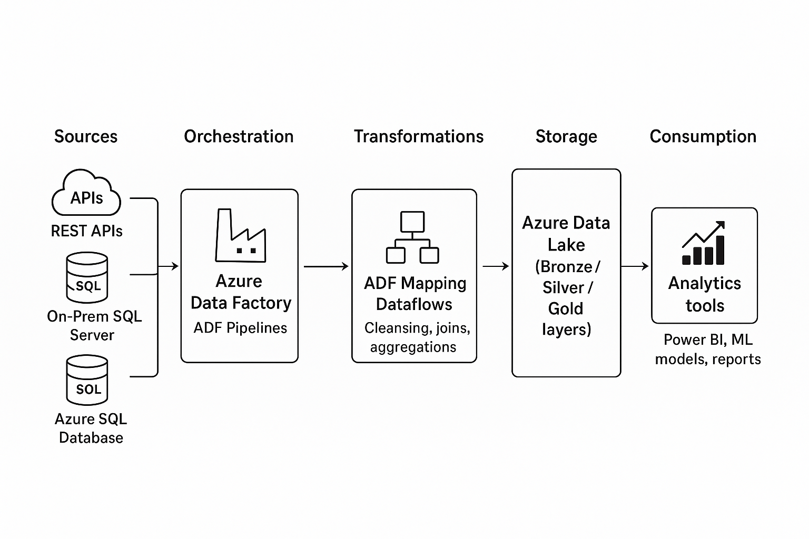
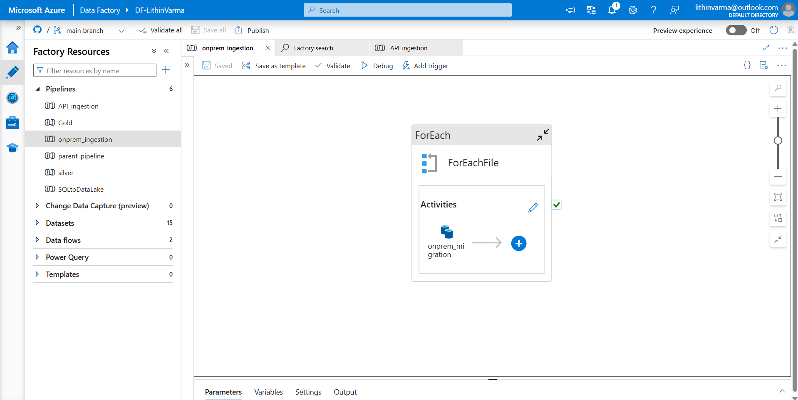
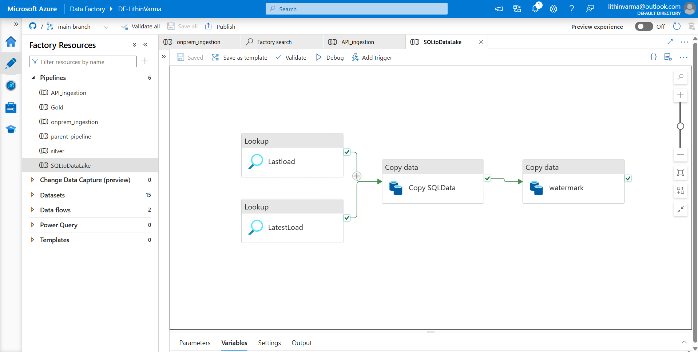
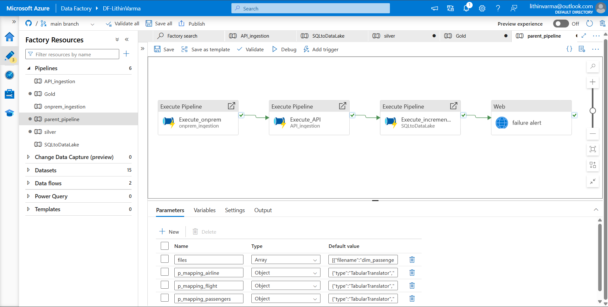
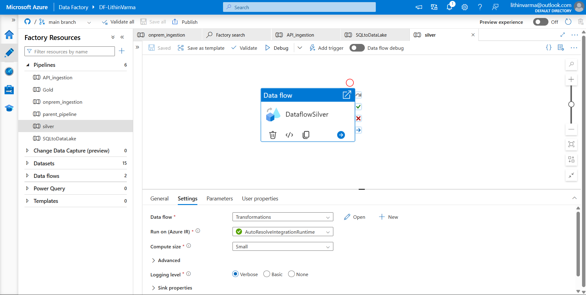
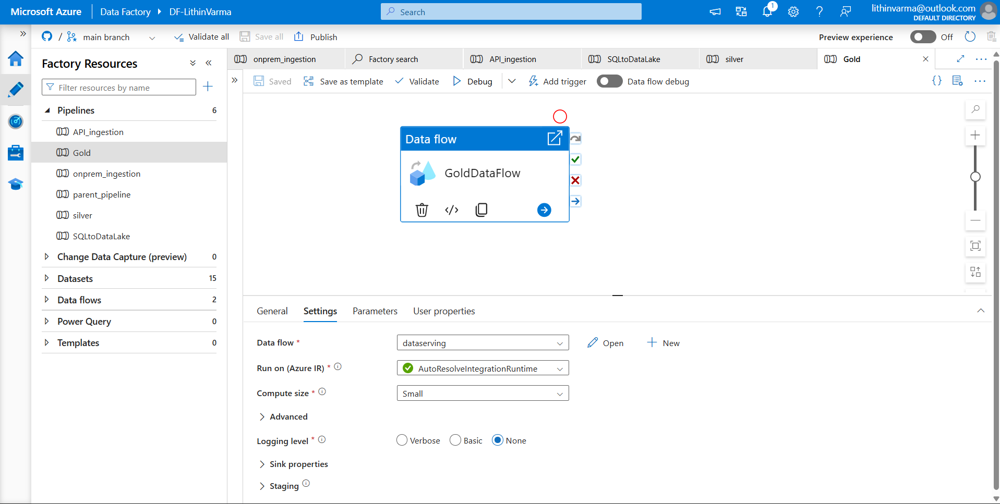
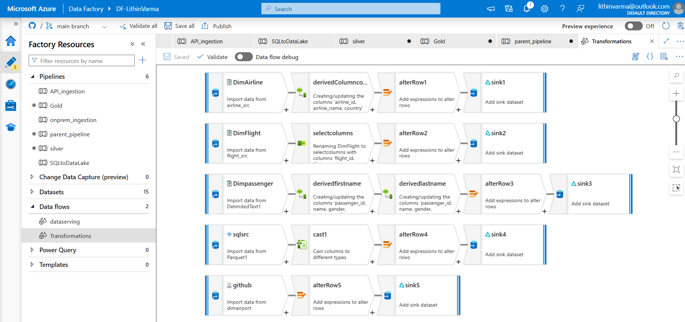
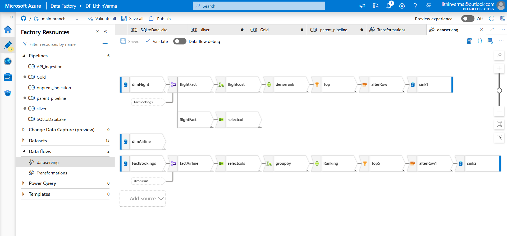

# ✨ Azure Data Factory Project – End-to-End ETL Pipeline

## 📌 Overview
This project demonstrates an **Enterprise Data Engineering workflow** using **Azure Data Factory (ADF)**.  
It includes multiple pipelines and dataflows that handle **data ingestion, transformation, and orchestration** across sources like **APIs, On-Premises Databases, and Azure SQL**.  

The architecture follows a **Bronze → Silver → Gold** data layering pattern, ensuring raw data is ingested, cleansed, transformed, and served for analytics.

---

## 🏗️ Architecture

The project follows a **layered architecture (Bronze → Silver → Gold)** with Azure Data Factory orchestrating the entire ETL process.  

  

### 🔹 Flow:
1. **Data Ingestion (Bronze Layer)**  
   - REST APIs → Azure Data Lake (Bronze)  
   - On-Prem SQL / Flat Files → Azure Data Lake (Bronze)  
   - Azure SQL Database (Incremental Loads) → Azure Data Lake (Bronze)  

2. **Data Transformation (Silver Layer)**  
   - Cleansing, standardization, mapping, enrichment using **ADF Mapping Dataflows**  

3. **Data Serving (Gold Layer)**  
   - Curated, aggregated, and analytics-ready data for **reporting and dashboards**  

4. **Orchestration**  
   - **ADF Pipelines** manage ingestion and transformation workflows  


## 🔄 Pipelines

### 1. API Ingestion  
Ingests data from external REST APIs into the Data Lake.  


### 2. On-Prem Ingestion  
Moves on-premises SQL/flat-file data into the lake using a `ForEach` pattern.  


### 3. SQL to Data Lake  
Implements **incremental loading** with watermarks for SQL data ingestion.  


### 4. Parent Pipeline (Orchestration)  
Acts as the **master pipeline**, chaining API, On-Prem, and SQL pipelines with failure alerts.  


### 5. Silver Layer Pipeline  
Executes transformations and persists data into the **Silver layer**.  


### 6. Gold Layer Pipeline  
Serves aggregated and enriched data into the **Gold layer** for analytics/BI consumption.  


---

## 🔧 Dataflows

### 1. Transformations Dataflow  
Handles column mapping, data cleansing, casting, and enrichment of multiple source datasets.  


### 2. Data Serving Dataflow  
Applies business rules such as ranking, filtering, grouping, and cost calculations before loading into sinks.  


---

## 🚀 Features
- ✅ Automated data ingestion from **APIs, SQL, On-Prem**  
- ✅ Incremental loads with **watermarking**  
- ✅ **Parameterized pipelines** for reusability  
- ✅ Data transformations following **Bronze → Silver → Gold** model  
- ✅ Central orchestration with **parent pipeline & alerts**   

---


## 📂 Repository Structure
```
  ├── pipelines/ # JSON pipeline definitions
  ├── dataflows/ # JSON dataflows
  ├── linkedServices/ # Linked services (with Key Vault reference)
  ├── datasets/ # Dataset definitions
  ├── images/ # Exported pipeline & dataflow diagrams
  └── README.md # Project documentation
```

---
## 📝 Notes
- Secrets and connection strings are managed in **Azure Key Vault**, not exposed in this repo.  
- This project is intended for **educational / portfolio showcase purposes**.
